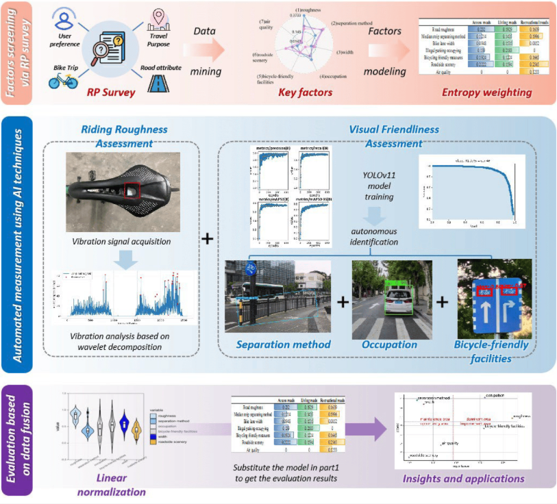








[同济大学交通学院](https://tjjt.tongji.edu.cn/)在读2022级本科生。[上海交通大学船舶海洋与建筑工程学院](https://naoce.sjtu.edu.cn/)2026级直博生。诚挚希望业界大佬联系交流。

# 📖 教育经历
- *2022.09 - 至今*, [同济大学](https://www.tongji.edu.cn/), 交通运输, 学士.
- *2024.09 - 至今*, [同济大学](https://www.tongji.edu.cn/), 人工智能, 辅修学士.

# 📝 学术论文 
📃 期刊论文

2025

Sensors

[A Comprehensive Framework for Evaluating Cycling Infrastructure: Fusing Subjective Perceptions with Objective Data](https://doi.org/10.3390/s25041168)

Kefei Tian, **Yifan Zheng**, Zhongyu Sun, Zishun Yin, Kai Zhu, Chenglong Liu\*

# 📚 发明专利
- 一种多模态数据融合的城市道路骑行友好性评价方法 CN202411889146.6

# 🏆 荣誉奖项
🏅 荣誉
- 2025.12, 同济大学**一等奖学金**.
- 2023.12, 同济大学**一等奖学金**.
- 2023.11, 同济大学**优秀学生**.

🏅 奖项
- 2025.08, “招行杯”第十八届全国大学生节能减排社会实践与科技竟赛**二等奖**.
- 2025.05, “船视宝”杯第二十届全国大学生交通运输科技大赛**二等奖**.
- 2024.12, 全国大学生数学建模竞赛**上海市二等奖**.
- 2024.06, 同济大学数学建模竞赛**一等奖**.

# 💻 实习经历
- 🔥`New！`2025.10 - 2026.03, 共青团上海市徐汇区委员会, 政务见习.
- 2025.07 - 2025.08, 中国铁路上海局集团有限公司, 毕业实习.

# 🔍 相关链接
 [WeChat](../images/WeChatQR.png) / [CSDN](https://blog.csdn.net/m0_74423692?spm=1000.2115.3001.10640) / [Github](https://github.com/FrdmZheng) / [Google Scholar](https://scholar.google.com/citations?user=a7KowJEAAAAJ&hl=zh-CN&oi=sra)
